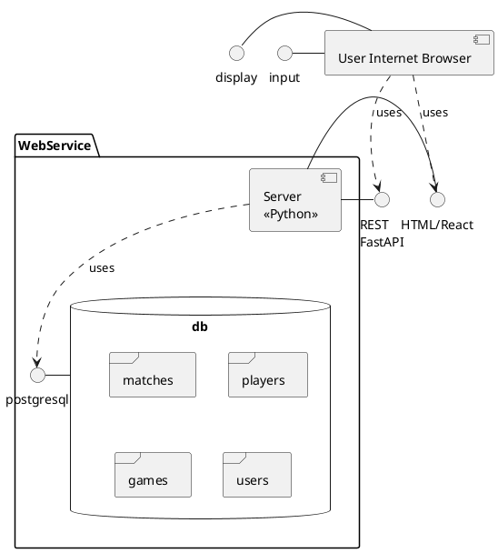
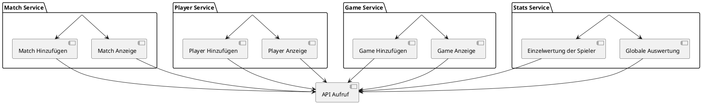
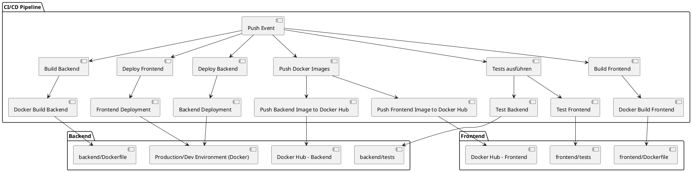

# 

**Über arc42**

arc42, das Template zur Dokumentation von Software- und
Systemarchitekturen.

Template Version 8.2 DE. (basiert auf AsciiDoc Version), Januar 2023

Created, maintained and © by Dr. Peter Hruschka, Dr. Gernot Starke and
contributors. Siehe <https://arc42.org>.

# Einführung und Ziele

## Aufgabenstellung

## Qualitätsziele

* Stabilität
* Übersichtlichkeit
* Komfortabilität

## Stakeholder

| Rolle         | Erwartungshaltung |
|---------------|-------------------|
| *Organisator* | *\<Erwartung-1>*  |
| *Spieler*     | *\<Erwartung-2>*  |

# Kontextabgrenzung

## Technischer Kontext

# Lösungsstrategie

# Bausteinsicht

## Whitebox Gesamtsystem

***\<Übersichtsdiagramm>***

Begründung  
*\<Erläuternder Text>*

Enthaltene Bausteine  
*\<Beschreibung der enthaltenen Bausteine (Blackboxen)>*

Wichtige Schnittstellen  
*\<Beschreibung wichtiger Schnittstellen>*

### \<Name Blackbox 1>

*\<Zweck/Verantwortung>*

*\<Schnittstelle(n)>*

*\<(Optional) Qualitäts-/Leistungsmerkmale>*

*\<(Optional) Ablageort/Datei(en)>*

*\<(Optional) Erfüllte Anforderungen>*

*\<(optional) Offene Punkte/Probleme/Risiken>*

### \<Name Blackbox 2>

*\<Blackbox-Template>*

### \<Name Blackbox n>

*\<Blackbox-Template>*

### \<Name Schnittstelle 1>

…

### \<Name Schnittstelle m>

## Ebene 2

### Whitebox *\<Baustein 1>*

*\<Whitebox-Template>*

### Whitebox *\<Baustein 2>*

*\<Whitebox-Template>*

…

### Whitebox *\<Baustein m>*

*\<Whitebox-Template>*

## Ebene 3

### Whitebox \<\_Baustein x.1\_\>

*\<Whitebox-Template>*

### Whitebox \<\_Baustein x.2\_\>

*\<Whitebox-Template>*

### Whitebox \<\_Baustein y.1\_\>

*\<Whitebox-Template>*

# Laufzeitsicht

## *\<Bezeichnung Laufzeitszenario 1>*

-   \<hier Laufzeitdiagramm oder Ablaufbeschreibung einfügen>

-   \<hier Besonderheiten bei dem Zusammenspiel der Bausteine in diesem
    Szenario erläutern>

## *\<Bezeichnung Laufzeitszenario 2>*

…

## *\<Bezeichnung Laufzeitszenario n>*

…

# Verteilungssicht

## Infrastruktur Ebene 1

***\<Übersichtsdiagramm>***

Begründung  
*\<Erläuternder Text>*

Qualitäts- und/oder Leistungsmerkmale  
*\<Erläuternder Text>*

Zuordnung von Bausteinen zu Infrastruktur  
*\<Beschreibung der Zuordnung>*

## Infrastruktur Ebene 2

### *\<Infrastrukturelement 1>*

*\<Diagramm + Erläuterungen>*

### *\<Infrastrukturelement 2>*

*\<Diagramm + Erläuterungen>*

…

### *\<Infrastrukturelement n>*

*\<Diagramm + Erläuterungen>*

# Querschnittliche Konzepte

## *\<Konzept 1>*

*\<Erklärung>*

## *\<Konzept 2>*

*\<Erklärung>*

…

## *\<Konzept n>*

*\<Erklärung>*

# Architekturentscheidungen

# Qualitätsanforderungen

**Weiterführende Informationen**

Siehe [Qualitätsanforderungen](https://docs.arc42.org/section-10/) in
der online-Dokumentation (auf Englisch!).

## Qualitätsbaum

## Qualitätsszenarien

# Risiken und technische Schulden

# Glossar

| Begriff        | Definition        |
|----------------|-------------------|
| *\<Begriff-1>* | *\<Definition-1>* |
| *\<Begriff-2*  | *\<Definition-2>* |
